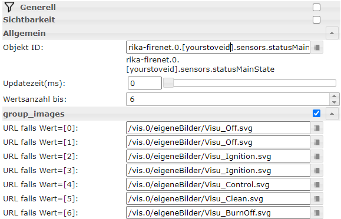

# ioBroker.rika-firenet

**Tests:** 

## RIKA-Firenet adapter for ioBroker

Control your RIKA stoves

## Information
First initial release, only polling values from your stove. Setting-actions will follow soon.
Polling-intervall minimum is 1 minute so you do not appear to be a DOS-Attacker against their websites.
This Adapter was developed for my RIKA PARO, but should also work for other RIKA stoves.

Fill textboxes in Adapter-Config
* Username: (E-Mail for your Rika account)
* Password: (Password for your Rika account)
* Stove-ID: (go to your Rika account and find out)
* Polling-Interval: (min 1 Minute)

## Download Pictures and states for vizualisation
https://www.rika-firenet.com/images/status/Visu_Off.svg
use if sensors.statusMainState = 1 and sensors.statusSubState = 0 (Stove is off, Ofen ist aus)

https://www.rika-firenet.com/images/status/Visu_Standby.svg
use if sensors.statusMainState = 1 and sensors.statusSubState = 1 (Standby, Ofen auf Standby)

https://www.rika-firenet.com/images/status/Visu_Ignition.svg
use if sensors.statusMainState = 2 (Ignition, Zündung)

https://www.rika-firenet.com/images/status/Visu_Ignition.svg
use if sensors.statusMainState = 3 (Starting, Startphase)

https://www.rika-firenet.com/images/status/Visu_Bake.svg 

https://www.rika-firenet.com/images/status/Visu_HeatingUp.svg

https://www.rika-firenet.com/images/status/Visu_Control.svg
use if sensors.statusMainState = 4 (Regular Operationmode, Regelbetrieb)

https://www.rika-firenet.com/images/status/Visu_Clean.svg
use if sensors.statusMainState = 5 (Cleaning)

https://www.rika-firenet.com/images/status/Visu_BurnOff.svg
use if sensors.statusMainState = 6 (Burn Off, Ausbrand) 

https://www.rika-firenet.com/images/status/Visu_SpliLog.svg
use if sensors.statusMainState = 11, 13, 14, 16, 17 or 50 (Wood-log check, Scheitholzcheck)

https://www.rika-firenet.com/images/status/Visu_SpliLog.svg
use if sensors.statusMainState = 20 or 21 (Operation with wood-logs, Scheitholzbetrieb)

## Here's an example with vis (basic image):

## Detailed state-picture-combinations
* If not logged in log in at Rika WebLogin https://www.rika-firenet.com/web/login
* open https://www.rika-firenet.com/web/stove/[YOURSTOVEID]
* View sourcecode of this site (right mouse click - sourcecode)
* Find the sensors.statusMainState and sensors.statusSubState - combinations

## ToDo
* change from request to axios
* setting states 
* save password encrypted

## Changelog

### 0.0.5
* (xsawa32) some changes in README
### 0.0.4
* (xsawa32) some changes in main.js
### 0.0.3
* (xsawa32) some changes in main.js
### 0.0.1
* (xsawa32) initial release

## License
MIT License

Copyright (c) 2020 Andreas Wass <a.wass@sbg.at>

Permission is hereby granted, free of charge, to any person obtaining a copy
of this software and associated documentation files (the "Software"), to deal
in the Software without restriction, including without limitation the rights
to use, copy, modify, merge, publish, distribute, sublicense, and/or sell
copies of the Software, and to permit persons to whom the Software is
furnished to do so, subject to the following conditions:

The above copyright notice and this permission notice shall be included in all
copies or substantial portions of the Software.

THE SOFTWARE IS PROVIDED "AS IS", WITHOUT WARRANTY OF ANY KIND, EXPRESS OR
IMPLIED, INCLUDING BUT NOT LIMITED TO THE WARRANTIES OF MERCHANTABILITY,
FITNESS FOR A PARTICULAR PURPOSE AND NONINFRINGEMENT. IN NO EVENT SHALL THE
AUTHORS OR COPYRIGHT HOLDERS BE LIABLE FOR ANY CLAIM, DAMAGES OR OTHER
LIABILITY, WHETHER IN AN ACTION OF CONTRACT, TORT OR OTHERWISE, ARISING FROM,
OUT OF OR IN CONNECTION WITH THE SOFTWARE OR THE USE OR OTHER DEALINGS IN THE
SOFTWARE.
